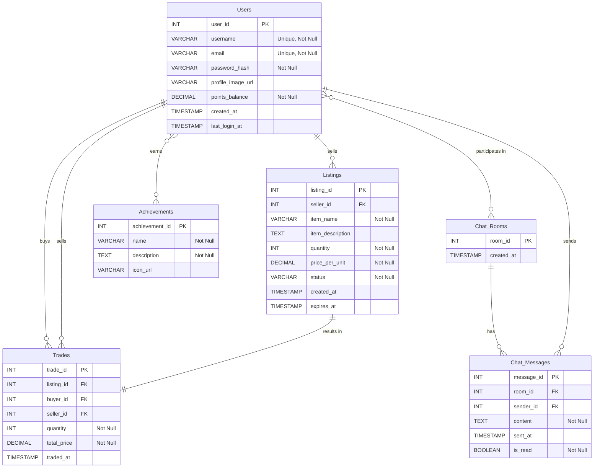

```mermaid
erDiagram
    Users ||--o{ Listings : "sells"
    Users ||--o{ Trades : "buys"
    Users ||--o{ Trades : "sells"
    Listings ||--|| Trades : "results in"

    Users }o--o{ Chat_Rooms : "participates in"
    Chat_Rooms ||--o{ Chat_Messages : "has"
    Users ||--o{ Chat_Messages : "sends"

    Users }o--o{ Achievements : "earns"

    Users {
        INT user_id PK
        VARCHAR username "Unique, Not Null"
        VARCHAR email "Unique, Not Null"
        VARCHAR password_hash "Not Null"
        VARCHAR profile_image_url
        DECIMAL points_balance "Not Null"
        TIMESTAMP created_at
        TIMESTAMP last_login_at
    }

    Listings {
        INT listing_id PK
        INT seller_id FK
        VARCHAR item_name "Not Null"
        TEXT item_description
        INT quantity "Not Null"
        DECIMAL price_per_unit "Not Null"
        VARCHAR status "Not Null"
        TIMESTAMP created_at
        TIMESTAMP expires_at
    }

    Trades {
        INT trade_id PK
        INT listing_id FK
        INT buyer_id FK
        INT seller_id FK
        INT quantity "Not Null"
        DECIMAL total_price "Not Null"
        TIMESTAMP traded_at
    }

    Chat_Rooms {
        INT room_id PK
        TIMESTAMP created_at
    }

    Chat_Messages {
        INT message_id PK
        INT room_id FK
        INT sender_id FK
        TEXT content "Not Null"
        TIMESTAMP sent_at
        BOOLEAN is_read "Not Null"
    }

    Achievements {
        INT achievement_id PK
        VARCHAR name "Not Null"
        TEXT description "Not Null"
        VARCHAR icon_url
    }
```
